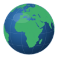

<p align="center">
  
</p>

# Know the World

A browser geography game: draw countries freehand, place them on a world map, and
get scored on how close your shape and position are to the real thing. Plus flag
quizzes, a "rank the economies" mode, and a data explorer — all in vanilla
HTML/CSS/JS with no build step.

**Play it:** https://lolispo.github.io/geo-draw-the-world/

## Game modes

- **Daily Challenge** — one deterministic country per day
- **Quick 10** — 10 random countries
- **Famous 5** — the 5 largest countries by area
- **Speed Round** — a 3-minute timer, as many as you can
- **Streak** — keep going until your score drops below 25
- **Continents / World** — all 7 continents, or every country
- **Regions** — Africa, Europe, Asia, N. America, S. America, Oceania

Plus combinable toggles (Placement Only, Tweak, Blind, Explorer, Hard) and
separate flag-guessing, flag-color-picker, rank-line, and data-explorer modes.

## Running locally

It's a static site — just serve the folder over HTTP (the data loads via `fetch`,
so opening `index.html` directly won't work):

```bash
python3 -m http.server 8080
# then open http://localhost:8080
```

## How it works

- **Canvas** for all rendering; freehand drawing supports multiple shapes.
- Shapes are projected with a **Mercator projection** into a 1600×900 world space.
- Scoring rasterizes your placed shape and the reference and computes
  **intersection-over-union (IoU)**.
- Touch support on the drawing, transform, and world canvases.

## Data

- **Geometry** — [Natural Earth](https://www.naturalearthdata.com/) (public domain),
  projected into the game's Mercator space.
- **Country stats** — [World Bank Open Data](https://data.worldbank.org/).
- All datasets join on the **ISO 3166-1 alpha-2** country code. See
  [`docs/DATA.md`](docs/DATA.md) for the regeneration pipeline.

## Project layout

| Path | What |
|---|---|
| `index.html` | All game screens |
| `js/main.js` | Central `Game` class / state machine |
| `js/drawing-canvas.js`, `js/transform-controls.js`, `js/world-canvas.js` | The three interactive canvases |
| `js/scoring.js` | Rasterized IoU scoring |
| `js/geo-data.js`, `js/datasets.js` | Data loading and reference shapes |
| `data/` | Country geometry, stats, flags |
| `scripts/` | Data regeneration (Node) |
